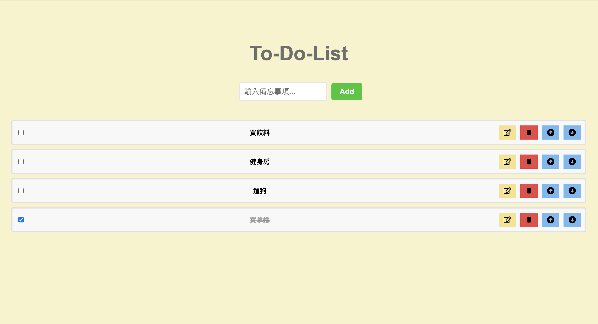
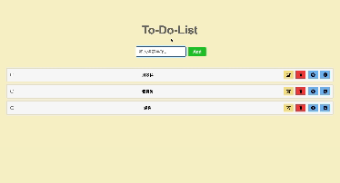

# A simple ToDoList

## Description

A simple ToDoList with React.

- Create(Add new task)
- Read(Task view)
- Update(Edit task)
- Delete(Delete task)

## Requirement

- Node.js

## Demo Screenshot

## Getting Started

Install the packages with $ npm install.
Run the server with $ npm run dev.
Open http://localhost:3000 to view it in your browser.

## Author

Email:yiting536@gmail.com

## Warning

This is purely for practice and not for any profit-making purpose.Thanks!
